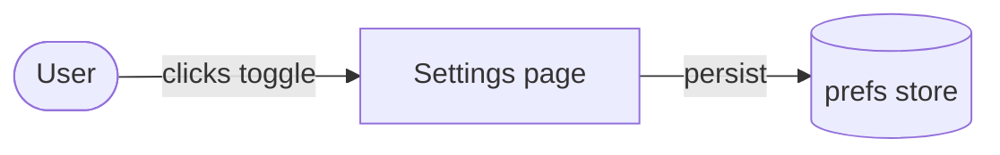

# mentor Plan Strategy

## Step 0 — Resolve the plan output format (md | html)

`begin-plan.sh` already resolved and printed the effective format as a **`FORMAT:`** line in its
stdout. Read it — it selects the Step-6b persistence path and which document-format section you
follow:

- **`FORMAT: html`** — persist the plan as the bespoke styled HTML document. Follow
  **[Step 8 — HTML Plan Document Format](#step-8--html-plan-document-format-when-format--html)**.
- **`FORMAT: md`** — persist the plan as a self-contained, Mermaid-first Markdown document. Follow
  **[Step 8M — Markdown Plan Document Format](#step-8m--markdown-plan-document-format-when-format--md)**.
- **`FORMAT: UNSET`** — no format is persisted for this repo. Per begin-plan.sh's instruction, ask
  the user **once** which format to persist (Markdown / HTML) via `AskUserQuestion`. **When
  begin-plan.sh also reported the mode UNSET, ask BOTH in a SINGLE `AskUserQuestion` call (two
  questions)** — never two competing asks. Then persist the choice and continue:

  ```bash
  bash "${CLAUDE_PLUGIN_ROOT}/hooks/set-plan-output-format.sh" <md|html>   # map Markdown→md, HTML→html
  ```

> **Everything else in this skill is format-independent.** Strategy (Step 1), research + plan-author
> dispatch (Step 1.5), the footer markers (Step 5), and the mandatory **Use case scenarios** section
> are identical for both formats. Only **Step 6b** (how you persist) and the **document-format
> section** (Step 8 vs Step 8M) differ. The plan-author returns the same Markdown body either way; the
> `THEME:` spec it includes is consumed **only** by the HTML path (Step 8) and is ignored for md.

## Step 1 — Ask the 4-Option Strategy Question

> **plan-only repos skip this question.** If the harness entry (`begin-plan.sh` output) reported
> `MODE: plan-only`, do **not** ask — set `strategy: normal` (footer `strategy: normal` +
> `dispatch-agents: skipped`, no `worktree:` line) and proceed directly to Step 1.5. The plan is
> the deliverable; worktree isolation and implementation fan-out never run in plan-only mode, so
> the execution-strategy options below would be meaningless. Use the begin-plan.sh stdout as the
> signal — do not run an extra `set-mode.sh status` here.

Call `AskUserQuestion` with **exactly** this payload:

```json
{
  "question": "Which strategy for this plan?",
  "header": "Plan Strategy",
  "options": [
    {
      "label": "Normal plan",
      "description": "Typo fix, single-line tweak, or throwaway exploration. No worktree, no dispatch. Fast — plan exits with dispatch-agents: skipped."
    },
    {
      "label": "Dispatch agents only",
      "description": "Multi-step task that benefits from fan-out subagents but doesn't need branch isolation. Plan fans out into annotated agent steps."
    },
    {
      "label": "Worktree only",
      "description": "Non-trivial change isolated from main on its own branch. Single track, no agent fan-out."
    },
    {
      "label": "Worktree + Dispatch agents (Recommended)",
      "description": "Non-trivial multi-area work. Branch isolation + subagent fan-out. Default for most real feature work."
    }
  ]
}
```

---

## Step 1.5 — Mandatory Research + Plan-Author Dispatch (main-context optimization)

> **Always delegate BOTH research AND authoring to subagents.** During the plan phase the main
> thread does **no bulk codebase reading and does not draft the plan**. It *orchestrates*: it
> dispatches research, dispatches a **plan-author** agent, then renders the author's returned
> Markdown into the plan file (HTML or Markdown, per Step 0) and releases. Exploration, design, and the writing of the plan body are
> all delegated — this keeps the main conversation lean. Two hard floors enforce it in the
> plugin-owned flow:
> - after ~2 direct reads, `plan-read-gate.sh` blocks further bulk reads until you dispatch a
>   research subagent (escape hatch `MENTOR_PLAN_RESEARCH=off`); and
> - `plan-author-gate.sh` blocks the plan-file write until a **plan-author** agent has been
>   dispatched (escape hatch `MENTOR_PLAN_AUTHOR=off`).

**Ordering.** Do this *after* the Step 1 strategy choice. If you chose a **worktree** strategy,
allocate the worktree (Step 3) and `EnterWorktree` **first**, so the dispatched agents run
inside the worktree.

### Domain detection (before 1.5a)

Scan the user's task description (and refine after research FINDINGS return) against the
registry below. For each matched domain, invoke its planning skill **exactly once** via
`Skill(skill="…")` — the same skill-from-skill mechanism Step 6c uses for `plan-review`.
Multiple domains may match. If none match, invoke `Skill(skill="plan-domain-dynamic")` — the
dynamic-domain fallback: it dispatches a small domain-definer agent that names the domain and
returns global-best-practice directives on the fly.

| Domain | Trigger signals | Skill to invoke | Extra plan deliverable (rendered per format — Step 8/8M) |
|---|---|---|---|
| frontend | UX/UI — components, pages, styles, layout, design systems, theming, responsive | `Skill(skill="plan-domain-frontend")` | Live before/after mockups per changed surface (mockup-author agent, 1.5c) |
| backend-api | API/endpoint/route/handler/schema/DTO/contract | `Skill(skill="plan-domain-backend-api")` | Before/after contract diff tables + schema diffs + sequence-flow viz |
| architecture (C4) | Structural change — new/changed/removed service, container, datastore, queue, external integration, component, or data flow (NOT pure content/config/doc/style/refactor) | `Skill(skill="plan-domain-architecture")` | Diff-highlighted C4 Context/Container(/Component) diagrams, rendering only the levels that change |
| dynamic (fallback) | no registered domain matched | `Skill(skill="plan-domain-dynamic")` | Domain best-practices section (practice→step mapping) + domain-fitted viz idiom via THEME |

Each matched domain skill returns directives you fold into the research prompts (1.5a) and the
plan-author prompt (1.5b); the frontend domain additionally adds a mockup-author dispatch (1.5c).
(For the dynamic fallback, the directives come from its dispatched agent's DOMAIN BRIEF — not
the skill text itself; dispatch that agent **before** 1.5a so the brief can shape the research
prompts.)

### 1.5a — Dispatch research (proportional to the strategy)

- **Normal plan** — a single low-effort `Explore` agent (still "always dispatch"; keeps the main
  thread out of the files even for a quick, well-scoped task). For Normal you MAY fold research +
  authoring into one agent — see 1.5b.
- **Dispatch / Worktree / Worktree+Dispatch** — **2–4 parallel `Explore` agents** over *disjoint*
  areas (issue all their `Agent` calls in one message).

You may take up to ~2 direct reads of the **user-named** files to frame the work; everything
beyond that must be delegated.

If a domain matched (see *Domain detection* above), fold that domain skill's research directives
into the relevant `Explore` agents' prompts — for the dynamic fallback, fold the DOMAIN BRIEF's
RESEARCH DIRECTIVES.

**Research return contract — put this in every research agent's prompt.** Each agent returns, and
nothing more:

- **FINDINGS** — conclusions only, ≤ ~400 words.
- **EVIDENCE** — `file:line` references only. **No file dumps, no pasted source blocks.**
- **OPEN QUESTIONS** — anything blocking, as a short list.

The main thread holds only these distilled returns — never the agents' raw file contents.

### 1.5b — Dispatch the plan-author (the plan body is authored by a subagent)

After research returns, dispatch **ONE `Plan` agent** (`model: opus`, high effort) to author the
plan. **The main thread does NOT draft or redesign the plan — it is courier + renderer only.**

- The agent's **prompt MUST contain the literal token `mentor:plan-author`** — this is the signal
  `plan-author-gate.sh` recognizes to release the plan-file write (the `Plan` role is a fallback
  signal). Without it, your Step 6b write is blocked.
- Hand it: the chosen strategy, the distilled research FINDINGS/EVIDENCE, the worktree info (if
  any), and the open questions.
- If a domain matched, fold its plan-author directives into the prompt (e.g. frontend's
  `Proposed UI changes per surface` section; backend-api's contract tables and schema diffs;
  the dynamic fallback's DOMAIN BRIEF — best-practices section, pitfalls into edge
  cases/verification, VIZ IDIOM into the THEME spec).
- **Deliverable (its entire return):** the **complete, footer-compliant plan body in Markdown** —
  Context, **Use case scenarios** (actors/triggers, current vs expected behavior, numbered
  concrete walkthroughs with inputs→outcome, edge cases/assumptions — see **Step 8b**), Approach,
  per-topic visualization **specs** (one per significant change/decision — each a *short prose
  description* of what to show + the idiom; the renderer realizes each per **Step 8** rule 9 (HTML:
  polished HTML illustration) or **Step 8M** (Markdown: Mermaid / GFM table / ASCII), and skips any
  UI wireframe a frontend mockup already renders),
  implementation steps (with `[role: … · model: … · effort: …]` annotations for dispatch
  strategies, grouped under `Run in parallel:` / `Sequential:`), critical files, out-of-scope,
  verification, and the **Step 5 footer markers** verbatim. **For the HTML format only**, also have
  it include a short **`THEME:` spec** (palette direction, font pairing, primary visualization idiom
  — ~5 lines; see Step 8 "Design the document"); the `THEME:` spec is **ignored for md** (Markdown
  uses the viewer's theme), so omit it when Step 0 resolved `md`. Tell it to follow **Step 4**
  (dispatch format) and **Step 5** (footer) of this skill.
- **Generalist-reviewer principle (unconditional, every plan and every domain path):** tell the
  plan-author to write for a generalist reviewer, not a domain expert — define domain jargon at
  first use, state why each step matters, prefer concrete examples over abstractions; the plan
  must be understandable and approvable by someone outside the domain.
- For a **Normal** plan you may fold 1.5a + 1.5b into a single agent: dispatch one agent whose
  prompt carries the `mentor:plan-author` token that both explores and returns the full body.

The main thread takes the agent's returned Markdown **as** the plan body and proceeds to Step 6
(surface it, render it into the plan file, release). It does not rewrite it — at most it fixes a missing
footer marker that `strategy-guard.sh` flags.

> **Async-harness note (await · receive · render) — applies to Step 6 too.** In this harness `Agent`
> dispatches run **async**: the call returns immediately and the agent's result arrives later (the
> agent completes in the background). To **await** the plan-author (or any background agent), **end
> your turn and let the harness re-invoke you when it completes** — do **NOT** busy-poll the agent in
> a Bash `sleep`/`while` loop (it wastes the turn and races the ~9-minute Bash timeout, which was
> observed firing twice in one session).
>
> **Receiving the body.** When the author completes, **take its returned body from the delivered
> completion message** — that text *is* the plan body. Do **NOT** reconstruct it by listing task
> `.output` files or reading `subagents/*.jsonl`, and do **NOT** treat a body-less idle/completion
> notification as "no result": if the notification carries no body, request the final body **once**
> via the normal completion channel (a `SendMessage` to that agent) and let it be delivered — never
> scrape the transcript, never busy-poll.
>
> **The Stop gate nudges, it does not deliver.** `plan-html-stop-gate.sh` blocks the turn once if you
> try to end with the author dispatched but no plan file persisted, then **allows the stop on the
> immediate retry** so you are never trapped — it does **not** re-invoke you *with* the body. So
> before ending the turn, make sure you have received the body (above) and rendered it. When the
> author returns, **render the Step 6b plan file yourself in the main thread** — never offload the render
> to a separate agent, which only reintroduces the busy-wait.

This research+author dispatch is **orthogonal** to the Step 1 *execution-strategy* dispatch
question: a Normal-strategy plan still delegates research + authoring here. (`dispatch-agents`
shares these contracts.)

### 1.5c — Frontend mockup-author dispatch (only when the frontend domain matched)

After the plan-author returns, dispatch the mockup-author per `Skill(skill="plan-domain-frontend")`
— that skill **owns** the dispatch contract, the skip-when-no-visual-delta rule, and the
re-dispatch-on-revision rule — and inject its returned fragments into the Step 8
*Before / After (mockup)* section. The `plan-author-gate` is already released by then; the
`mentor:frontend-mockup` token satisfies no gate.

---

## Step 2 — Decision Table

| Answer | Pre-plan actions | Required footer markers |
|---|---|---|
| Normal plan | None | `strategy: normal` + `dispatch-agents: skipped` |
| Dispatch agents only | None | `strategy: dispatch` + dispatch annotations |
| Worktree only | Allocate worktree → EnterWorktree (see §Worktree Procedure) | `strategy: worktree` + `worktree: … (branch=…, source=…)` + `dispatch-agents: skipped` |
| Worktree + Dispatch | Allocate worktree → EnterWorktree (see §Worktree Procedure) | `strategy: worktree+dispatch` + `worktree: … (branch=…, source=…)` + dispatch annotations |

---

## Step 3 — Worktree Procedure (options 3 & 4 only)

### 3a. Derive a slug from the user's request

Rules: kebab-case, ≤30 chars, drop articles (a/an/the/and/or/in/on/at), keep nouns and verbs.

Examples:
- "Fix the auth retry loop" → `fix-auth-retry-loop`
- "Add dark mode toggle to settings" → `add-dark-mode-toggle-settings`
- "Refactor payment processing module" → `refactor-payment-processing`

### 3b. Allocate the worktree (inline)

Run this Bash block, substituting `<slug>` from Step 3a:

```bash
slug="<slug>"
repo_root="$(git rev-parse --show-toplevel)"
repo="$(basename "$repo_root")"
worktree_path="${repo_root}/../worktrees/${repo}-${slug}"
branch="feature/${slug}"

# Capture the user's current branch — this is the "source" branch the worktree
# will be cut from, and the branch /ship will merge back into at finish time.
source_branch="$(git -C "$repo_root" rev-parse --abbrev-ref HEAD)"
if [ "$source_branch" = "HEAD" ]; then
  echo "ERROR: detached HEAD — refusing to allocate worktree. Check out a named branch first." >&2
  exit 1
fi

# Try fresh branch from explicit source; if it already exists, check it out into the worktree.
git -C "$repo_root" worktree add -b "$branch" "$worktree_path" "$source_branch" 2>/dev/null \
  || git -C "$repo_root" worktree add "$worktree_path" "$branch"

abs_path="$(cd "$worktree_path" && pwd)"

# Seed gitignored env/config files from the source checkout into the new worktree
# so a service can run (a fresh worktree is a clean checkout; .env is gitignored/absent).
( cd "$repo_root" && git ls-files --others --ignored --exclude-standard -z ) \
  | while IFS= read -r -d '' rel; do
      case "$rel" in
        .env|.env.*|*/.env|*/.env.*|.envrc|*/.envrc)
          mkdir -p "$abs_path/$(dirname "$rel")"
          cp "$repo_root/$rel" "$abs_path/$rel" ;;
      esac
    done

# Persist source/feature branches in the main repo's git-owned worktree metadata dir
# (NOT inside the working tree — keeps it out of `git status` and safe from `git clean`).
wt_name="$(basename "$abs_path")"
state_dir="$(git -C "$repo_root" rev-parse --git-path "worktrees/${wt_name}")"
mkdir -p "$state_dir"
printf '{"source_branch":"%s","feature_branch":"%s"}\n' \
  "$source_branch" "$branch" \
  > "$state_dir/mentor.json"

echo "{\"path\":\"${abs_path}\",\"branch\":\"${branch}\",\"source\":\"${source_branch}\"}"
```

> This seeds root and nested env files (e.g. `frontend/.env`, `backend/.env`) — small config only, never `node_modules`.

If both `git worktree add` invocations fail (e.g. path conflict, dirty index), surface the error to the user and abort — do not silently proceed. If the current HEAD is detached, abort with the message above and ask the user to check out a named branch first.

### 3c. Root-switch into the worktree

Call the built-in tool:
```
EnterWorktree(path=<abs_path from the echo above>)
```

All subsequent exploration, file reads, and agent dispatches run inside the worktree.

> **Dev-stack reminder (post-implementation):** after implementation agents run, any local dev
> server (Docker Compose, Vite, Next.js dev, etc.) almost certainly still bind-mounts the **main
> checkout** — not this worktree — so your changes won't be visible at runtime until you either:
> - Re-point the stack from the worktree once agents finish:
>   `docker compose -p <project-name> -f docker-compose.yml up -d`
> - Or wait until after `/ship` merges back to the source branch.
> Act on this after the plan is approved and agents complete — not now.

### 3d. Continue with plan exploration inside the worktree

Run normal plan-mode Phase 1 (Explore) and Phase 2 (Plan) operations inside the worktree.
All Read, Bash, and agent calls operate on the worktree's copy of the codebase.

---

## Step 4 — Dispatch Format (options 2 & 4 only)

For each agent step, follow the format defined in `Skill(skill="dispatch-agents")`
(shipped with this plugin — authoritative reference, do not duplicate here):

```
Step N — <title>  [role: <subagent_type> · model: <opus|sonnet|haiku> · effort: <low|medium|high>]
  Goal: …
  Inputs: …
  Prompt sketch: …
  Done when: …
```

Group independent steps under `Run in parallel:`. Sequential dependencies under `Sequential:`.

---

## Step 5 — Plan Body Footer (mandatory)

Every plan **must** end with this footer block. Include only the applicable lines:

```
strategy: <normal|dispatch|worktree|worktree+dispatch>
worktree: <abs-path> (branch=feature/<slug>, source=<source-branch>)   ← only when strategy includes worktree
dispatch-agents: skipped                                                ← only when strategy is normal or worktree-only
```

The `source=<source-branch>` field is the branch the worktree was cut from (echoed by the allocate step in 3b). The `/ship` flow reads this field as the **base** for the ship target the user chooses at finish time — either pushing the feature branch to its own remote and opening a PR/MR against this source, or fast-forwarding into the local copy of this source. `/ship` never pushes worktree commits into the remote source branch without an explicit confirmation.

---

## Step 6 — Surface, Persist, Then Release (mandatory)

> **🚫 Hard gate — no edits or implementation until the plan is APPROVED.**
> No source edits and no implementation-agent dispatch may happen until the plan is approved.
> During planning, only READ-ONLY research/review agents (Explore, Plan, `/plan-review`
> reviewers) may be dispatched — every editing/implementation agent comes AFTER approval.
> This is enforced by a `PreToolUse` hook regardless of which flow you are in, and you do not
> get to choose: if a `.planning` marker exists (you entered via `/mentor:plan`),
> `plan-phase-gate.sh` DENIES in-repo edits **even under `bypassPermissions`**; otherwise
> (native plan mode) `block-edits-in-plan-mode.sh` denies them. The only file you may write
> during planning is the plan file (it lives outside the repo).

The plan body — **authored by your plan-author subagent in Step 1.5b**, not drafted here — is now
final and footer-compliant (Step 5). You have **three** responsibilities, in order: surface (6a),
persist (6b), then **release** via whichever path matches how you entered (6c).

> **Two release paths.** This plugin supports a plugin-owned flow and a native fallback, and 6c
> auto-selects between them by checking for the `.planning` marker:
>
> - **Owned flow** (`.planning` present — you came from `/mentor:plan`, the session is
>   already in `bypassPermissions`): release by running `approve-plan.sh`. There is **no**
>   `ExitPlanMode` call and **no** `.proceed-mode` — the marker gate is the approval surface.
> - **Native fallback** (no marker — native plan mode via Shift+Tab): release via the proceed-mode
>   question + `.proceed-mode` marker + `ExitPlanMode`, exactly as before.

> **⚠️ The 6b file is the ONLY plan file — never write the harness-native `~/.claude/plans/*.md`.**
> When plan mode starts, Claude Code creates its own native plan file at
> `~/.claude/plans/<name>.md` and tells you *"this is the only file you are allowed to edit."*
> **Ignore that for the plan artifact.** This plugin persists the plan under
> `$HOME/.claude/mentor/<repo>-<hash>/plans/<slug>.{html|md}` (Step 6b) — a styled `.html`
> **or** a Mermaid-first `.md`, per the repo's resolved format (Step 0) — and **that** file is the
> source of truth. The `PreToolUse:Write|Edit` `block-native-plan-md` guard **rejects any write to
> `~/.claude/plans/*.md`** (the harness-native dir — a DIFFERENT location from the mentor plans dir,
> so an md-format mentor plan is unaffected); do not attempt the native file, you'd only get an
> exit-2 redirect back here. Write **only** the mentor plan file to
> `$HOME/.claude/mentor/<repo>-<hash>/plans/…` (outside the working tree; the worktree-confine guard
> allows it). The `PreToolUse:ExitPlanMode` guard **blocks your exit until that fresh plan file
> exists** — so 6b is not optional and not skippable, regardless of how you got here.

### 6a. Surface the plan in the conversation

The plan body is the Markdown your **plan-author agent returned** in Step 1.5b — surface it
verbatim, do not re-draft it. `ExitPlanMode` does **not** accept a `plan` argument; the native modal summarises Claude's plan-mode buffer, not a file on disk. To guarantee the user can review the full plan before approving, emit the complete footer-compliant plan body in your **next assistant message** — plain markdown, no extra commentary around it. The user reads it in the transcript; the release question in 6c that follows is the clean approval gate. The plan body MUST include per-topic visualization illustrations (one per significant change/decision) and the **Use case scenarios** section (Step 8b) so the user can verify the agent understood the use case before approving.

> **⚠️ Do NOT end your turn after 6a.** A message that contains only the plan body text and no
> tool calls **ends the turn** — the harness yields to the user, 6b/6c never run, no plan file is
> persisted, no approval question is asked, and the `.planning` marker is left armed (blocking
> repo edits in later sessions until it goes stale). After emitting the body, **continue in the
> same turn**: immediately call the 6b path-computation Bash block (in the same response as the
> body text, or as your very next action — never yield to the user between 6a and 6c). Keep the
> 6a→6b **order** (in HTML mode the `plan-source` block in the 6b HTML must be byte-identical to the
> 6a body; in md the `.md` body itself IS the 6a body); only the turn boundary is forbidden, not the
> ordering. This is **enforced by a `Stop` hook**
> (`plan-html-stop-gate.sh`): while `.planning` is armed and a plan-author has returned, the
> turn is blocked from ending until a plan `.html` newer than the author dispatch exists — in
> every mode (plan / plan-only) the plan file is the deliverable, not the chat text.

Do not skip this step on the grounds of brevity. If the plan body is long, the user still wants to see it — let them scroll.

### 6b. Persist the plan file (mandatory, global, not in the repo)

After 6a, save the plan to a **user-global** location — the artifact the user actually reviews
(it auto-opens for review) and the file every downstream hook reads. The path is derived from the
repo root — never written inside the working tree. **Branch by the format resolved in Step 0:**

- **`html`** — a single **self-contained styled HTML document**; follow **Step 8** below.
- **`md`** — a single **self-contained Markdown document**; follow **Step 8M** below.

The only mechanical difference is the file extension (`.html` vs `.md`); the gate, the auto-open,
and the "Keep it current" rule are identical for both.

> **Gated by `plan-author-gate.sh`.** This Write is **blocked** until you have dispatched the
> plan-author agent in Step 1.5b (the one whose prompt carries `mentor:plan-author`, or a `Plan`
> agent). If you see the block, you tried to author the plan in the main thread — dispatch the
> plan-author agent first, then write the plan file from its returned body. Escape hatch for trivial
> sessions: `MENTOR_PLAN_AUTHOR=off`. (Mirror of the read-gate floor in Step 1.5.)

Run this Bash block to compute the path and create the directory (substituting `<slug>` from Step 3a, or `plan` if no slug):

```bash
slug="<slug>"
git_common="$(git rev-parse --git-common-dir 2>/dev/null)"
repo_root="$(cd "$(dirname "$git_common")" && pwd)"
repo_base="$(basename "$repo_root")"
repo_hash="$(printf '%s' "$repo_root" | shasum | cut -c1-8)"
plans_dir="$HOME/.claude/mentor/${repo_base}-${repo_hash}/plans"
mkdir -p -m 700 "$plans_dir"   # 700: plans may contain sensitive paths/snippets
ext="<html|md>"                # the format resolved in Step 0: html → html, md → md
echo "${plans_dir}/${slug}.${ext}"   # slug-derived, NO timestamp — stable across revisions (see "Keep it current")
```

Then use the `Write` tool to save the document to the path the block echoed, per the format resolved in Step 0 — **`html`:** an HTML document following **[Step 8 — HTML Plan Document Format](#step-8--html-plan-document-format-when-format--html)** exactly; **`md`:** a Markdown document following **[Step 8M — Markdown Plan Document Format](#step-8m--markdown-plan-document-format-when-format--md)** exactly. **Render and `Write` the plan file yourself in the main thread — do NOT dispatch a separate agent to render it.** Rendering is the main thread's courier+**renderer** role; offloading it to a background agent forces a Bash busy-wait that races the harness timeout (observed: two ~9m20s `exit 143` stalls in one session — see the async-harness note in Step 1.5b).

**For the HTML format (Step 8), the document has two parts that must stay in sync:**

1. A **rendered `<body>`** — the human review surface, with a **bespoke plan-specific theme designed per Step 8** (executing the plan-author's `THEME:` spec). The plan body MUST include polished per-topic visualization illustrations (one per significant change/decision, each in the clearest format for its topic), including visualization treatment of the Use case scenarios section (Step 8b), so the user understands each change at a glance.
2. A **`<script type="text/markdown" id="plan-source">` block** carrying the **complete canonical plan in Markdown**, byte-for-byte identical to the body you emitted in 6a — **including the Step 5 footer markers and any dispatch annotations, verbatim**. This block is the single source of truth that every downstream consumer (strategy-guard, dispatch-executor, plan-review) reads; the rendered body must faithfully reflect it.

**For the Markdown format (Step 8M), there is no two-part split:** the `.md` file *is* the single
canonical source. It is byte-identical to the 6a body — the Step-5 footer markers as **bare,
unindented lines at end-of-file** and any dispatch annotations inline, with **no `plan-source`
block** (downstream consumers read the `.md` directly). The Mermaid/ASCII/table visualizations
*are* the body; there is no separate rendered surface to keep in sync.

Do not write inside `<repo>/.claude/` or `<worktree>/.claude/` — those locations are deprecated as of v0.13.0.

> **The plan file (HTML or `.md`) is the single, self-contained, *local* review surface — not a
> claude.ai-hosted Artifact.** It is opened locally by `plan-open.sh`; do **not** publish it (or, in
> HTML mode, its mockups) as a
> Claude `Artifact`, and do **not** embed any external/published artifact URL inside it — the
> Artifact runtime's strict CSP blocks cross-origin content, so every embedded mockup must be an
> inline `<iframe srcdoc>` (Step 8 rule 7). Ad-hoc `Artifact()` calls from subagents mint detached
> URLs that drift from this file; keep all review content in this one HTML so the file on disk and
> what the user reviews stay in lockstep.

**Keep it current.** Whenever you revise the plan content during this session (new step, changed approach, edited footer), **re-write this same plan file** (`.html` or `.md`, per Step 0) so it always reflects the latest plan. The path is **slug-derived and timestamp-free** (the block above), so re-running that compute on a revision yields the **same** file — overwrite it in place; never create a second timestamped copy (that would desync the open review tab from what the gates validate). You do **not** need to open it manually — the `PostToolUse` `plan-open.sh` hook opens it for review the **first time it is created**:

- **HTML** — inside VSCode it opens as a **focused editor tab** (render it in the integrated browser with one keystroke via the *Live Preview* extension — see the plugin README), otherwise in **Google Chrome → the OS default browser**.
- **Markdown** — opens as a **VSCode editor tab** when a VSCode CLI is available (toggle the preview with ⇧⌘V; install a Markdown-Mermaid preview extension to render the diagrams), otherwise the **OS default Markdown handler** — never a raw-text browser tab (Chrome is deliberately skipped for `.md`).

Later Write/Edits refresh it **in place** (no new tab/window, no focus-steal) — an HTML plan self-refreshes and Live Preview/the browser reloads on file change; a Markdown preview / GitHub view re-renders on save or refresh. Opener precedence is set by `MENTOR_PLAN_OPENER` (`auto`/`vscode`/`chrome`/`system`); set `MENTOR_PLAN_OPEN=off` to disable. Configure both under `env` in `~/.claude/settings.json` (a shell `export` won't reach the hook — hooks run as separate processes).

### 6c. Release — pick the path that matches how you entered

First detect which flow you are in. Compute the plans dir (same derivation as 6b) and check for the
`.planning` marker:

```bash
[ -f "${plans_dir}/.planning" ] && echo "OWNED" || echo "NATIVE"
```

- **OWNED** (`.planning` present — you came from `/mentor:plan`; the session is already
  in `bypassPermissions`): use **6c-owned**.
- **NATIVE** (no marker — native plan mode via Shift+Tab): use **6c-native**.

#### 6c-owned. Approve via `approve-plan.sh` (no `ExitPlanMode`)

The session is already in `bypassPermissions`, so there is no permission mode to choose and no
`ExitPlanMode` to call — the marker gate is the sole approval surface. The user has reviewed the
full plan (6a body + the auto-opened plan).

**First check the repo mode** (the script prints `mode: <mode>` or `UNSET`):

```bash
bash "${CLAUDE_PLUGIN_ROOT}/hooks/set-mode.sh" status
```

- **mode is `plan-only`** → the plan is the DELIVERABLE; there is no implementation. Ask a
  **Deliver plan / Review the plan (light) / Keep planning** question instead (same shape as
  below, with "Proceed" replaced by `{ "label": "Deliver plan", "description": "Validate the
  plan and release the gate. The plan file is the deliverable — no implementation, no
  dispatch (repo mode: plan-only)." }`). On **Deliver plan**, run `approve-plan.sh` exactly as
  on Proceed below, then **end the turn** reporting the plan's file path — do NOT implement
  and do NOT dispatch implementation agents.
- **any other mode (or `UNSET`)** → ask the standard **Proceed / Review the plan (light) /
  Keep planning** question:

```json
{
  "question": "The plan is ready. Proceed to implementation?",
  "header": "Proceed",
  "options": [
    { "label": "Proceed", "description": "Validate the plan, release the edit gate, and begin implementation. The session is already in bypassPermissions, so no per-edit prompts." },
    { "label": "Hand off to next agent", "description": "Approve the plan and release the gate, but don't implement here — write a /mentor:handoff document so a fresh agent picks up implementation from the approved plan, then stop. No dispatch in this session." },
    { "label": "Review the plan (light)", "description": "Run /plan-review — fan out 3 read-only reviewers (practicality, comprehensiveness, cleanliness) over this plan. Stays in planning; surfaces findings, then asks again." },
    { "label": "Keep planning", "description": "Do not release — keep refining the plan. Re-write the plan file (6b) and ask again when ready." }
  ]
}
```

On **Proceed**, run:

```bash
bash "${CLAUDE_PLUGIN_ROOT}/hooks/approve-plan.sh"
```

`approve-plan.sh` validates the plan (footer markers + a fresh plan file, by delegating to
`strategy-guard.sh`). **If valid**, it deletes the `.planning` / `.research-dispatched` /
`.read-budget` markers (the edit gate OPENS — repo edits are now allowed) and prints the dispatch
directive for `dispatch` / `worktree+dispatch` strategies. **If invalid**, it prints the exact
problem, **keeps the `.planning` marker** (the gate stays closed), and exits non-zero — fix the
plan (re-write the plan file per 6b) and run it again.

On **Hand off to next agent**, run:

```bash
bash "${CLAUDE_PLUGIN_ROOT}/hooks/approve-plan.sh" --handoff
```

Same validation + gate release as Proceed, but it **suppresses the dispatch directive**. **Follow
the hand-off directive the hook prints to stdout** — it instructs you to invoke the handoff skill
for this approved plan and then stop. Do **not** implement and do **not** dispatch in this session.
If the script exits non-zero (invalid plan — the gate stays closed), fix the plan per 6b and re-ask
this same question.

On **Review the plan (light)**, invoke `Skill(skill="mentor:plan-review")` and prepend this
instruction in your message immediately before the Skill call:
> "The user selected 'Review the plan (light)' — skip plan-review Step 4 (Run vs Pass gate)
> and proceed directly to Step 5 (dispatch block)."

Its reviewers are read-only `Agent` dispatches, so the edit gate stays closed; `plan-review`
resolves this plan's `.html` via its own Step 1 fallback (newest in the plans dir). Do **not** run
`approve-plan.sh` or edit the plan from this option. When the reviewers return, surface their
findings; if the user wants any folded in, revise and re-write the plan file (6b); then **re-ask this
same Proceed / Review / Keep-planning question** — this option never releases the gate by itself.

On **Keep planning**, do not run the script; return to planning. After a successful release, for
dispatch strategies follow the printed directive; otherwise implement the plan directly.

#### 6c-native. Approve via `ExitPlanMode` (fallback — native plan mode)

This is the pre-v0.21 path, used only when there is no `.planning` marker. It selects the
permission mode the session lands in **and** is the approval gate (the native `ExitPlanMode` modal
is suppressed by the plugin's `PermissionRequest` hook).

> **plan-only repos:** if `set-mode.sh status` reports `mode: plan-only`, the plan is the
> deliverable here too — after `ExitPlanMode` is approved, do NOT implement and do NOT dispatch
> (the dispatch-executor hook also suppresses its directive in plan-only mode). Report the plan
> file path and stop.

**Escape hatch first.** If `MENTOR_PLAN_EXIT_MODE` is set to a valid mode (`acceptEdits`,
`bypassPermissions`, or `default`), **skip the question** and use that value. Read it with:

```bash
echo "${MENTOR_PLAN_EXIT_MODE:-<unset>}"
```

If unset or invalid, call `AskUserQuestion`:

```json
{
  "question": "Once you approve, how should I proceed? (This is the approval — no separate modal will appear.)",
  "header": "Proceed Mode",
  "options": [
    { "label": "Accept edits (Recommended)", "description": "Land in acceptEdits: auto-apply file edits and common fs commands without prompting; protected paths (.git, configs) are still guarded. Always available. Best for reviewing via git diff afterward." },
    { "label": "Bypass permissions", "description": "Land in bypassPermissions: no prompts at all. Takes effect only when this session was launched with bypass available (you run permissions.defaultMode: bypassPermissions, so it is). Use for fully autonomous runs." },
    { "label": "Review each edit", "description": "Land in default: prompt on every edit and command. Maximum oversight, slowest." },
    { "label": "Keep planning", "description": "Do not exit — keep refining the plan. Pick this to iterate instead of approving." }
  ]
}
```

Map: **Accept edits → `acceptEdits`**, **Bypass permissions → `bypassPermissions`**, **Review each
edit → `default`**. On **Keep planning**, do not write the marker and do not call `ExitPlanMode`.
Otherwise record the chosen mode (one-shot marker consumed by the `PermissionRequest` hook), then
call `ExitPlanMode` with no arguments:

```bash
printf '%s\n' "<chosen-mode>" > "${plans_dir}/.proceed-mode"
```

The `PreToolUse:ExitPlanMode` strategy-guard validates the footer markers + a fresh `.html` before
exit (a guard rejection leaves the `.proceed-mode` marker untouched for your retry); the
`PermissionRequest:ExitPlanMode` hook then auto-approves the exit and switches the mode. The native
modal's extras (Ultraplan, `Ctrl+G`, clear-context) are not offered — iterate via **Keep planning**.
`PostToolUse:ExitPlanMode` (dispatch-executor) fires once execution begins.

---

## Done When (strategy-guard acceptance criteria)

The plugin's `hooks/strategy-guard.sh` (PreToolUse:ExitPlanMode) validates the plan body.
It accepts the plan when all of the following are true for the chosen strategy:

| Strategy | Required markers |
|---|---|
| `normal` | `strategy: normal` AND `dispatch-agents: skipped` AND no `worktree:` line |
| `dispatch` | `strategy: dispatch` AND ≥1 `[role: … · model: … · effort: …]` annotation AND no `dispatch-agents: skipped` |
| `worktree` | `strategy: worktree` AND `worktree: /… (branch=…, source=…)` AND `dispatch-agents: skipped` |
| `worktree+dispatch` | `strategy: worktree+dispatch` AND `worktree: /… (branch=…, source=…)` AND ≥1 dispatch annotation |

If the hook rejects the plan (exit 2), it prints the exact missing marker to stderr.
Fix the plan body and call `ExitPlanMode` again — do not create a new plan file.

---

## Step 8 — HTML Plan Document Format (when format = html)

> **This section applies only when the format resolved in Step 0 is `html`.** For `md`, skip to
> **[Step 8M — Markdown Plan Document Format](#step-8m--markdown-plan-document-format-when-format--md)**.

The persisted plan file (Step 6b) is a **single self-contained `.html` document** with no external
build step. It serves two audiences and must satisfy both:

- **Humans** read the rendered `<body>` — a bespoke, plan-specific design-doc that you design
  per plan (see "Design the document" below).
- **Machines** (strategy-guard, dispatch-executor, plan-review) read the
  `<script type="text/markdown" id="plan-source">` block — clean Markdown, never the rendered HTML.

### Machine contract (non-negotiable)

1. **The `plan-source` block is authoritative.** It contains the **complete** plan in Markdown,
   identical to what you emitted in 6a, **including the Step 5 footer markers** (`strategy:`,
   `worktree:`, `dispatch-agents:`) and any `[role: … · model: … · effort: …]` dispatch
   annotations, each on its own line, verbatim. Downstream hooks grep these lines out of this
   block — if a marker is missing or reworded here, the guard rejects the plan.
2. **The `plan-source` block is the LAST element** before `</html>`, raw and unescaped Markdown.
   Just ensure the plan text never contains the literal string `</script>`.
3. **Render the body from that source — represent every section, but don't echo directives or
   stand-ins.** Every piece of `plan-source` is one of three kinds, and the body treats each
   differently:
   - **Shared** (byte-identical in both; the body only *styles* it): prose, the implementation steps
     (including their inline `[role: … · model: … · effort: …]` annotations), tables, schema-diff
     lines, and the backend-api contract table + sequence-flow text (rule 8).
   - **Source-only directives** (live in `plan-source`, **realized** in the body, **never echoed as
     visible body text**): the plan-author's `THEME:` spec — *execute* it into the document's CSS (see
     "Design the document"), never print the `THEME:` block — and the **Step-5 footer markers**
     (`strategy:` / `worktree:` / `dispatch-agents:`), which stay machine-only. Their realized form
     *is* their body presence.
   - **Stand-ins** (a one/two-line placeholder in `plan-source` that the body **replaces** with the
     realized rich visualization — shown *instead of*, never *in addition to*): the per-topic
     visualization specs (rule 9), the mockup section (rule 7), and the contract-examples JSON (rule 8).

   **Invariant (replaces "nothing is hidden"):** every plan-source *section* must be **represented** in
   the body — either shared-and-styled, or realized from its directive/stand-in. Nothing real is
   dropped; directives and stand-ins are never reproduced verbatim. The body may still rearrange,
   group, cross-link, and summarize. (Safe by construction: machine consumers — strategy-guard,
   dispatch-executor, plan-review — read only `plan-source`, never the body.)
4. **HTML-escape all prose and code** when you place it in the body: `&` → `&amp;` first, then
   `<` → `&lt;`, `>` → `&gt;`. (Inside the `plan-source` script block, do **not** escape.)
5. **Self-contained.** Inline all CSS. At most one Google Fonts `<link>` is allowed, but always
   keep a system-font fallback so the file renders offline. No external JS, images, or build step —
   **except** the Mermaid runtime sanctioned in **rule 11** (the one deliberate external-JS
   carve-out, for complex diagrams; everything else stays self-contained).
6. **Every `<details>` gets a stable, unique `id`**, and the self-refresh `<script>` (in the
   skeleton below) is included **verbatim, byte-for-byte** — it preserves scroll position and
   open panels across in-place refreshes. Do not modify it.
7. **Frontend domain only — live mockup section.** When the frontend domain matched (and there is
   a visual delta), the body MUST include a `<h2 id="mockup">Before / After (mockup)</h2>` section
   — one comparison block per changed surface, each pane rendered as an `<iframe srcdoc="…">`
   carrying the mockup-author's self-contained mini-document (see `plan-domain-frontend`). The
   mockup markup is **body-only**: the `plan-source` block carries a one-paragraph prose stand-in
   under a `## Before / After (mockup)` heading instead — never the iframe/mockup HTML. Escape
   each `srcdoc` value in this order: `&` → `&amp;` first, then `"` → `&quot;` (do not escape
   `<`/`>`). Render the mockup-author's extra fields: `CALLOUTS:` as a numbered list keyed to the
   ➊➋➌ markers in the AFTER iframe; `TOKENS:` as a swatch strip (color tokens get a color chip);
   the `VIEWPORT:` value as a label on the AFTER pane; any `A11Y:` note alongside; and when an
   `--- AFTER (mobile 360) ---` doc was returned, a third AFTER pane with its iframe capped at
   360px wide. When more than one surface changed, lead the section with a one-line `Surfaces:`
   index and give each block a stable `id`. Link the section from your nav/outline. If the domain
   matched but there is no visual delta, render the section as a one-line "no visual change" note.
   The styling of panes, badges, and callouts is yours to design.
8. **Backend-api domain — contract visualization.** When the backend-api domain matched: the
   contract table (with its `Status` badge / `compat:` tokens), the per-DTO schema diffs, and the
   sequence-flow viz spec are **plain Markdown** — they live identically in both the body and
   `plan-source`. The body MAY *style* them without changing the source text: make the
   NEW/CHANGED/BREAKING/DEPRECATED status tokens visually distinct badges, colorize the
   `+`/`-`/`~` schema-diff lines (the Markdown characters stay in plan-source — your CSS only
   colorizes), and render the sequence flow with new/removed/changed hops visually distinct plus
   a legend that decodes the colors. The **only** body-only backend viz is the optional
   before/after **JSON example** pair per BREAKING/CHANGED endpoint (a side-by-side panel of
   `<pre><code>` blocks with `&`/`<`/`>` escaped). For those, `plan-source` carries a one-line
   prose stand-in per endpoint under a `## Contract examples` heading — never the escaped JSON.
9. **Per-topic visualizations — realize them as polished HTML, never echo the spec.** The plan-author's
   per-topic visualization items (Step 1.5b deliverable) are **specs**: short prose saying *what to
   show* and the *idiom*. They are plan-source **stand-ins** (rule 3) — the body MUST render each as a
   **polished HTML illustration** in the spec's place: a real `<table>` for a data-model / record
   shape, an HTML/CSS box-and-arrow layout for a sequence or data flow, a CSS grid for a page
   wireframe, and so on. **Never ship ASCII box-drawing (`├─ ┌─┐ │ └┘`), arrow-art (`→ ⇒`), or
   sparkline glyphs inside a `<pre>` as the final visualization** — `<pre>` is for literal code/JSON
   only. **Each visualization appears once**, under its owning topic: do not also create a separate
   "Visualization specs" umbrella section or a "see VIZ N above" back-reference stub. **Exclusion:**
   this rule does NOT touch the backend-api **shared** artifacts of rule 8 (the contract table, the
   `+`/`-`/`~` schema diffs, and the sequence-flow viz spec) — those stay byte-identical in
   `plan-source` and the body only *styles* them (a flow diagram, NOT `<pre>` arrows); do not
   reclassify them as stand-ins. **Frontend de-dup:** when the rule-7 mockup renders **live panes** for
   a UI surface, that mockup *is* the surface's visualization — do not also emit a per-topic UI
   wireframe for it. (A no-visual-delta surface, where the mockup section is only a one-line note, may
   still get a per-topic UI viz.)
10. **Architecture domain — C4 diagrams.** When the architecture domain matched (see
    `plan-domain-architecture`): the body renders a **C4-model view** of the change — a diagram at each
    C4 level the change moves (**L1 System Context** and/or **L2 Container**, with **L3 Component** only
    when one container gains significant internal structure; **never L4**). Render **only** the levels
    that actually change. Each diagram is **polished HTML/CSS** (inline SVG allowed for connectors):
    boxes with a name + technology sub-label + one-line responsibility, connectors labelled with the
    relationship + protocol (sync/async), and **people/external systems styled distinctly** from
    in-system containers (C4 convention). **Diff-highlight** every element/edge with a legend (NEW
    added-green, CHANGED amber, REMOVED struck/red, UNCHANGED plain). This obeys rules 5 (self-contained
    — no external JS/images/build) and 9 (**no ASCII box-drawing / `<pre>` art**). The C4 itself is a
    **stand-in** (rule 3): the plan-author's prose C4 spec (element + relationship lists) lives in
    `plan-source`; the body shows the diagram **in its place**, never the spec text echoed beside it.
11. **Complex diagrams — Mermaid.js (the default for complex diagrams).** For **complex diagrams**
    — entity-relationship (ER) data models, sequence flows, state machines, class diagrams, or any
    flow too dense for a clean hand-authored layout — render with **Mermaid.js**, the default idiom
    for these. (Simple record shapes, small box-and-arrow flows, wireframes, and the rule-10 C4 views
    stay hand-authored HTML/CSS + inline SVG per rules 9–10.) This is the **one sanctioned exception
    to rule 5's "no external JS"**: load the runtime from CDN —
    `<script src="https://cdn.jsdelivr.net/npm/mermaid@11/dist/mermaid.min.js"></script>` — then
    `mermaid.initialize({ startOnLoad: true, theme: 'base', themeVariables: { … } })`. Mount each
    diagram as `<pre class="mermaid">…definition…</pre>`; the runtime replaces it with an SVG on load
    — this is the documented Mermaid mount point, **not** the rule-9-banned `<pre>` ASCII art. Like
    every rule-9 visualization the diagram is a **body-only realization** of a per-topic **stand-in**
    (rule 3): `plan-source` carries the one/two-line prose spec, the body shows the rendered diagram
    in its place.
    - **Theme alignment — set `themeVariables` per element, derived from THIS plan's THEME.** The
      diagram MUST visually match the bespoke document theme — never ship Mermaid's stock palette.
      Drive `theme: 'base'` and specify **each element's color explicitly** from the plan's CSS custom
      properties: `background`, `primaryColor` / `primaryBorderColor` / `primaryTextColor` (node &
      entity-header fills), `lineColor` / `textColor`, `secondaryColor` / `tertiaryColor`; for
      **sequence** diagrams also `actorBkg` / `actorBorder` / `actorTextColor`, `signalColor` /
      `signalTextColor`, `noteBkgColor` / `noteTextColor` / `noteBorderColor`, `activationBkgColor`;
      for **ER** diagrams also `attributeBackgroundColorOdd` / `attributeBackgroundColorEven`. Every
      fill must clear the **WCAG-AA contrast** bar (see "Readability constrains creativity") against
      both its own text and the document background, and **adjacent ER attribute rows must be visibly
      distinct** — never leave odd/even fills only a couple of hex apart (that renders as one flat,
      near-invisible block).
    - **ER v11 caveat — the row-color trap.** In Mermaid v11 the ER **attribute-row fills are NOT
      themable via `themeVariables`** (`attributeBackgroundColorOdd/Even` are ignored for the inner
      rows). Add a CSS override so the rows pick up the theme and pass contrast — e.g.
      `.er .row-rect-odd { fill: var(--row-odd); }` / `.er .row-rect-even { fill: var(--row-even); }`
      (inspect the rendered SVG's actual row classes and target them). Skipping this is exactly what
      makes an "approved" ER diagram render as near-invisible rows.
    - **Validate, but never inline the result.** Check syntax with the Mermaid Chart MCP validate
      tool — but it returns the **full embedded SVG/PNG (70k–500k chars) and overflows context every
      time**. Never read the raw result: save it to a path and extract only the verdict —
      `jq '{valid, diagramType, hasError: (has("error"))}' <output-file>`. Use the tool for validity
      only, never to retrieve the diagram.
    - **`Note over` semicolon trap.** Semicolons inside a sequence `Note over …: text` terminate the
      note parser early (silent truncation). Use `,` or `+` inside note text, never `;`.

### Design the document — bespoke theme, every time

The presentation is **yours to design, per plan**. There is no fixed theme, palette, font set,
CSS kit, or body section layout. Before writing the file, decide a deliberate art direction that
fits *this* plan's subject and helps the user review *this* plan fastest — then commit to it.

- **Choose visualization idioms native to the work.** A migration wants a phased timeline; an API
  change wants contract-diff panels; a refactor wants a dependency/module graph; a config/hook
  change wants a decision table or gate-flow diagram; a data change wants before/after record
  shapes. Invent the right idiom rather than forcing a generic one.
- **Layout follows content.** Order, group, and weight body sections by what the reviewer must
  verify to approve — there is no required section order in the body (the Markdown source keeps
  its own order; contract rule 3 still applies).
- **Quality bar:** distinctive and intentional — a cohesive palette committed via CSS custom
  properties, purposeful typography, clear hierarchy; the reviewer should grasp the plan's shape
  in ~10 seconds of scrolling. No generic-AI defaults: no unthemed grey cards, no
  purple-gradient-on-white boilerplate, no walls of unstyled prose.
- **Readability constrains creativity:** body text ≥15px-equivalent, WCAG-AA text/background
  contrast, code in a monospace stack, works at 1280px and degrades gracefully when narrow.
- **Full-width layout (fixed requirement).** Use the full viewport width — no narrow centered
  column. Spend the horizontal space on multi-column layouts, side-by-side comparisons, and wide
  visualizations; cap only individual *prose* line length for readability, never the page.
- **Animation & motion (fixed requirement — purposeful only).** Use CSS animation/transitions
  **only where motion increases understanding**: step-through sequence flows, staged
  before→after transitions, attention cues on the critical decision. Never decorative motion for
  its own sake; respect `prefers-reduced-motion`; everything must remain fully readable with
  animations off.
- **Explicit outline for long pages (fixed requirement).** When the rendered document is long
  (roughly more than ~3 screens), include an explicit, always-reachable outline of the whole plan
  — a sticky sidebar TOC or anchored section nav with numbered entries — so the reviewer can see
  the plan's full shape and jump anywhere. Short plans may use a lighter inline nav.
- **Design for the generalist reviewer.** Surface the jargon definitions and why-this-matters
  cues the plan-author wrote (1.5b principle) — don't bury them; a glossary chip, an inline
  definition, or a "why" annotation beside the step all work. When the dynamic-domain fallback
  ran, style the `Domain best practices applied` practice→step mapping clearly (e.g. a mapping
  table with step anchors).
- **Visualizations remain mandatory:** one polished illustration per significant change/decision,
  each in the clearest format for its topic, **plus** the Use-case-scenarios visualization
  (Step 8b). No restriction on visualization type.
- **The theme comes from the plan-author and stays stable across revisions.** The plan-author's
  deliverable includes a short `THEME:` spec (palette direction, font pairing, primary
  visualization idiom — ~5 lines); execute that spec and design the details yourself. When
  revising an existing plan file ("Keep it current", Step 6b), keep its established theme — never
  re-roll the design on a footer-marker fix.

### Minimal skeleton (the only fixed markup)

Everything outside the comments below is yours to design within the machine contract.

```html
<!DOCTYPE html>
<html lang="en">
<head>
<meta charset="utf-8">
<meta name="viewport" content="width=device-width, initial-scale=1">
<title><!-- PLAN TITLE --> · mentor</title>
<!-- optional: ONE Google Fonts link — always keep a system-font fallback in the CSS -->
<style>
  /* YOUR bespoke, plan-specific design system — all CSS inline (contract rule 5). */
</style>
</head>
<body>
  <!-- YOUR rendered plan: every plan-source section REPRESENTED (rule 3 — shared-and-styled, or
       realized from its directive/stand-in; the THEME spec + footer markers are NOT echoed), escaped
       (rule 4), including the Use case scenarios section with visualization treatment (Step 8b), the
       per-topic visualizations as polished HTML illustrations (rule 9), the domain sections (rules
       7/8/10 — incl. C4 architecture diagrams when the architecture domain matched), and the dynamic
       domain's best-practices section when matched. -->

<!-- Self-refresh: when the user returns to this already-open review tab, reload to the latest
     plan revision in place (no new tab, no focus-steal). Preserves scroll + open <details>.
     Include VERBATIM — do not modify (contract rule 6). -->
<script>
(function () {
  var KEY = 'ep-plan-view', armed = false;
  function save() {
    var o = {};
    document.querySelectorAll('details[id]').forEach(function (d) { o[d.id] = d.open; });
    try { sessionStorage.setItem(KEY, JSON.stringify({ y: window.scrollY, open: o })); } catch (e) {}
  }
  function restore() {
    try {
      var s = JSON.parse(sessionStorage.getItem(KEY) || '{}');
      if (s.open) document.querySelectorAll('details[id]').forEach(function (d) {
        if (d.id in s.open) d.open = !!s.open[d.id];
      });
      if (typeof s.y === 'number') window.scrollTo(0, s.y);
    } catch (e) {}
  }
  function leave() { armed = true; save(); }
  function back()  { if (armed) { armed = false; save(); location.reload(); } }
  window.addEventListener('blur', leave);
  window.addEventListener('focus', back);
  document.addEventListener('visibilitychange', function () { document.hidden ? leave() : back(); });
  if (document.readyState === 'loading') document.addEventListener('DOMContentLoaded', restore);
  else restore();
})();
</script>

<!-- ===== CANONICAL SOURCE — read by strategy-guard / dispatch-executor / plan-review =====
     Complete Markdown identical to 6a incl. the Step 5 footer markers. Raw, unescaped, LAST
     (contract rules 1–2). -->
<script type="text/markdown" id="plan-source">
<!-- # <Plan title>
## Context
…
strategy: <normal|dispatch|worktree|worktree+dispatch>
worktree: <abs-path> (branch=feature/<slug>, source=<source-branch>)
dispatch-agents: skipped
-->
</script>
</body>
</html>
```

### Step 8b — Use case scenarios (mandatory)

Every plan MUST contain a `## Use case scenarios` section, placed **directly after `## Context`**,
that demonstrates concrete understanding of the use case(s) before the user approves:

- **Actors & triggers** — who or what initiates the work and when (user action, API caller, hook,
  schedule, …).
- **Current vs expected behavior** — what happens today vs what should happen after this plan
  ships, stated concretely.
- **Scenario walkthroughs** — numbered (`Scenario 1: <name>`, …) concrete end-to-end traces:
  given inputs/state → steps through the (changed) system → expected outcome. At least one per
  distinct use case; use real values, paths, and payloads from research — not placeholders.
- **Edge cases & assumptions** — boundary inputs, failure paths, and any assumptions the plan
  makes about the use case; flag anything unverified so the user can correct it.

This section is plain Markdown and lives identically in the 6a surface and the persisted plan file
(in HTML mode, in the `plan-source` block; in **md** mode the `.md` is itself canonical). It MUST
additionally receive **visualization treatment** — e.g. an actor→trigger→outcome flow, a
current-vs-expected comparison, or step-through scenario panels — chosen to make the agent's
understanding verifiable at a glance. In HTML mode that treatment is realized in the rendered
`<body>`; in **md** mode it is realized inline as a Mermaid `flowchart`/`sequenceDiagram` of
actor→trigger→outcome or a current-vs-expected GFM table (Step 8M). If a walkthrough rests on an
unconfirmed assumption, mark it visibly so the user can reject the plan if the understanding is
wrong.

---

## Step 8M — Markdown Plan Document Format (when format = md)

> **This section applies only when the format resolved in Step 0 is `md`.** For `html`, use
> **[Step 8](#step-8--html-plan-document-format-when-format--html)** instead.

The persisted plan file (Step 6b) is a **single self-contained `.md` document**. Unlike the HTML
format, the Markdown file is **its own canonical source** — there is no `plan-source` block and no
separate rendered surface. It must keep the plugin's purpose — *rich content and visualization per
topic/change, to maximize the reviewer's understanding* — using **markdown-native** means:
**Mermaid diagrams, ASCII diagrams, GFM tables, and GFM alerts**. It renders richly on GitHub,
GitLab, and any Mermaid-capable Markdown viewer.

### Machine contract (non-negotiable)

1. **The `.md` file IS the canonical plan.** It is byte-identical to the body you emitted in 6a.
   Downstream consumers (strategy-guard, dispatch-executor, plan-review, grilling) read it directly
   — there is **no** `plan-source` block to extract.
2. **Footer markers are BARE lines at end-of-file.** The Step-5 footer (`strategy:`, `worktree:`,
   `dispatch-agents:`) MUST be plain, **unindented**, **unformatted** lines at the very end — never
   inside a list (`- strategy:`), bold (`**strategy:**`), a blockquote (`> strategy:`), or a code
   fence. The gates grep them line-anchored (`^strategy:` …); any decoration makes the plan FAIL
   validation. They render as visible metadata at the bottom — that is fine and honest.
3. **Dispatch annotations are inline, verbatim.** Keep each `[role: <type> · model: <model> ·
   effort: <effort>]` annotation on/under its step exactly as **Step 4** defines, grouped under
   `Run in parallel:` / `Sequential:`. The dispatch gate greps `[role: …]` from the file directly.
4. **Self-contained & portable.** No inline HTML, no `<style>`/CSS, no `<iframe>`, no inline SVG,
   no base64-embedded images. The only "external" dependency is the **Mermaid runtime the VIEWER
   supplies** (GitHub/GitLab render fenced ` ```mermaid ` natively); you embed only the diagram
   source.
5. **One file, present once.** The whole plan lives in this one file. Do not split it or write a
   second copy.

### Visualization idiom — decision rule (pick exactly ONE per artifact)

Realize each significant change/decision as a visualization, but choose the idiom by what the
artifact communicates — and **never represent one thing two ways**:

- **Tabular data** (field lists, contract diffs, status matrices, token lists, before/after value
  pairs, practice→step mappings) → **GFM table**. The richest *and* most portable idiom; prefer it
  whenever the message is "what are the values".
- **Topology / sequence / state** (call flows, state machines, ER cardinality, branching logic,
  dependency graphs) → **Mermaid** (` ```mermaid ` fenced: `flowchart`, `sequenceDiagram`,
  `stateDiagram-v2`, `erDiagram`, `classDiagram`). The canonical diagram idiom — renders on
  GitHub/GitLab.
- **Spatial / layout fidelity, or a Mermaid-unsupported idiom** (UI zone wireframes, fixed-width
  alignment, C4 where a flowchart is awkward) → **ASCII diagram in a code fence**. A deliberate
  carve-out (HTML mode bans ASCII; md allows it) — a fixed-width box shows *true* relative position
  and renders literally everywhere.
- **Callouts / cautions** → **GFM alert** (`> [!NOTE]`, `> [!WARNING]`, `> [!IMPORTANT]`, `> [!TIP]`,
  `> [!CAUTION]`). Keep the first line self-describing (e.g. "Warning: …") so it still reads in
  viewers that degrade alerts to plain blockquotes.
- **Literal code / payloads** → fenced code with a language tag (` ```json `, ` ```ts `, …).

### Anti-duplication (the single most important md rule)

In Markdown there is **no stand-in / realization split** — the plan-author's body *is* the rendered
document, so you (author + renderer in one) emit the **final** visualization directly:

- **Never** write a prose restatement of what a diagram shows *and* also include the diagram. Prose
  next to a diagram is limited to (a) a one-line caption, (b) a legend decoding colors/markers, and
  (c) the *why / non-obvious insight* the diagram cannot encode.
- **Never** show the same thing two ways (e.g. a Mermaid flow *and* an ASCII version of it). One
  artifact, one idiom.
- The diagram/table is the source of truth for its own contents — do not narrate them.

### Mermaid rules (md mode)

- **Do NOT set `theme` / `themeVariables` / `%%{init}%%` palette directives.** GitHub and GitLab
  override or ignore custom Mermaid theming and apply their own contrast-tested, light/dark-adaptive
  theme; hand-set palettes render inconsistently. (The HTML Step-8 rule-11 `themeVariables` / WCAG /
  ER-row-color work does **not** apply here — do not copy it in.)
- **Do NOT use `C4Context` / `C4Container`.** Those diagram types are experimental and fail to render
  on GitHub/GitLab. For C4-style architecture use a `flowchart TB` with `subgraph` boundaries +
  `classDef` status classes + a legend table (see `plan-domain-architecture`).
- **Keep each diagram small** — split a dense flow into 2–3 focused diagrams rather than one wall;
  large diagrams auto-shrink to unreadable text and GitHub refuses to render past a complexity cap.
- **`sequenceDiagram` note trap:** a `;` inside `Note over …: text` truncates the note — use `,` or
  `+`. Click/interaction events are stripped by GitHub — never rely on them.

### Per-topic visualizations & Use case scenarios

- **One visualization per significant change/decision**, realized inline under its owning topic (no
  umbrella "visualizations" section, no "see diagram above" stubs).
- The mandatory **Use case scenarios** section (Step 8b) gets visualization treatment too — a Mermaid
  `flowchart`/`sequenceDiagram` of actor→trigger→outcome, or a current-vs-expected GFM table — so the
  reviewer can verify the agent's understanding at a glance.

### Domain artifacts in md mode

When a domain matched (Step 1.5 registry), follow that domain skill's **Markdown-mode** subsection:

- **frontend** — no live mockups: render an **ASCII zone wireframe** (before/after) + a **before/after
  delta GFM table** + a **token table** (backtick the hex, e.g. `` `#0969da` ``, so GitHub shows a
  swatch) + a ➊➋➌ **callout list**. State plainly that md loses the live/faithful component preview.
- **backend-api** — the contract table & schema diffs stay plain GFM/fenced; the sequence-flow
  becomes a Mermaid `sequenceDiagram`; before/after JSON examples become fenced ` ```json ` pairs.
- **architecture** — C4 levels render as Mermaid `flowchart TB` + `subgraph` + `classDef`
  (NEW/CHANGED/REMOVED) + a legend table — **not** `C4Context`.
- **dynamic** — the `Domain best practices applied` practice→step mapping is a GFM table.

### Known limitations (state them — the user chose md knowingly)

Markdown cannot reproduce some of the HTML deliverable's richness; call these out when relevant so
the reviewer isn't surprised: no **live `<iframe>` before/after mockups** (the biggest loss — md gets
table + ASCII + token list); no **purposeful animation / step-through motion**; no **in-place
self-refresh** with scroll/panel-state preservation (a Markdown preview re-renders on save, GitHub on
refresh/re-push); **single-column linear** layout (side-by-side comparisons collapse to stacked
blocks or a 2-column table); and **platform styling** rather than a bespoke palette/typography.

### Generalist-reviewer principle (unchanged)

Write for a generalist reviewer: define domain jargon at first use, state why each step matters,
prefer concrete examples. The Markdown plan must be understandable and approvable by someone outside
the domain.

### Minimal skeleton

````markdown
# <Plan title>

## Context
…

## Use case scenarios
<!-- actors & triggers; current vs expected; numbered Scenario walkthroughs; edge cases &
     assumptions — WITH visualization treatment (Step 8b). -->



## Approach
…

### <Significant change 1>
<!-- ONE visualization realized inline (table / Mermaid / ASCII), per the decision rule -->

## Implementation steps
Run in parallel:
- Step 1 — <title>  [role: Explore · model: sonnet · effort: low]
  Goal: …  Done when: …

Sequential:
- Step 2 — <title>  [role: general-purpose · model: opus · effort: high]
  …

## Critical files
## Out of scope
## Verification

strategy: <normal|dispatch|worktree|worktree+dispatch>
worktree: <abs-path> (branch=feature/<slug>, source=<source-branch>)
dispatch-agents: skipped
````

> The footer block is the LAST content in the file — bare, unindented lines (include only the lines
> applicable to the chosen strategy, exactly as **Step 5** defines).
